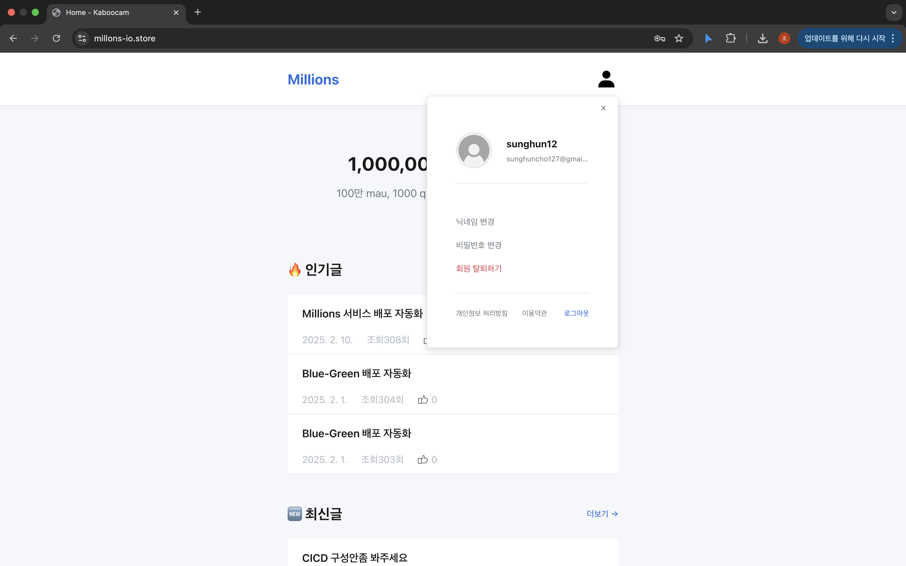
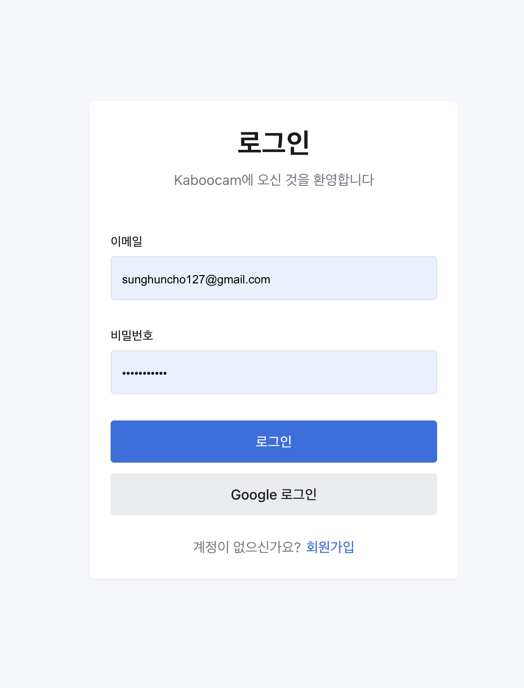
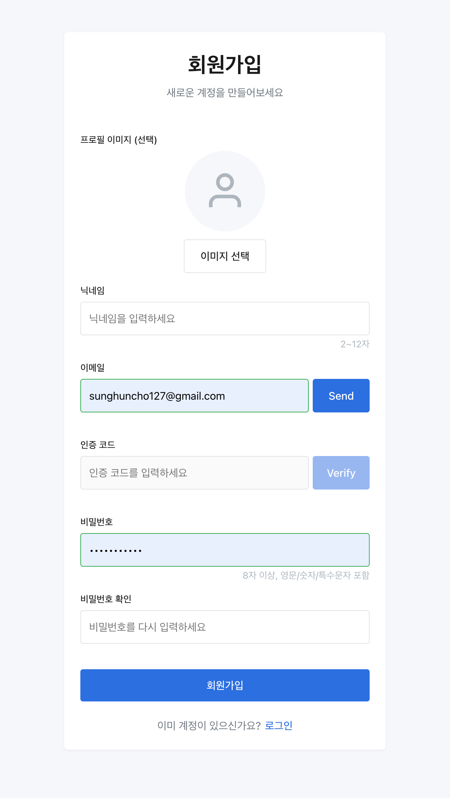
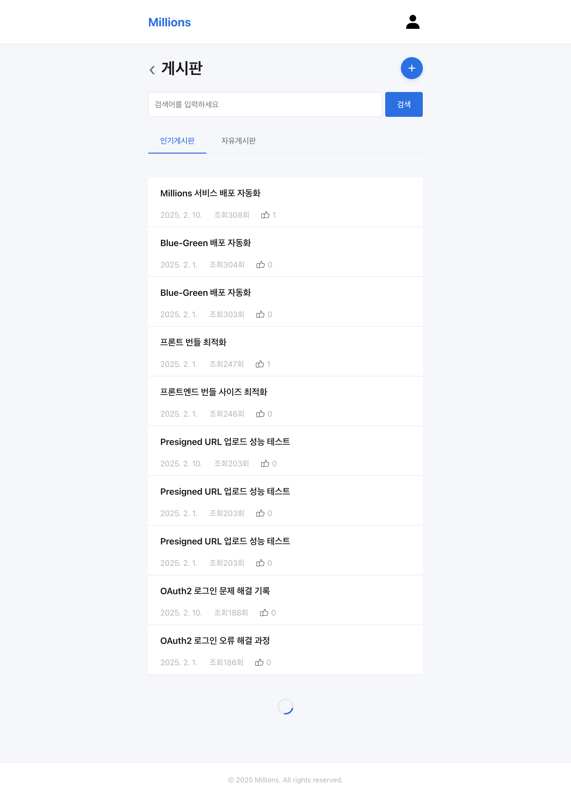
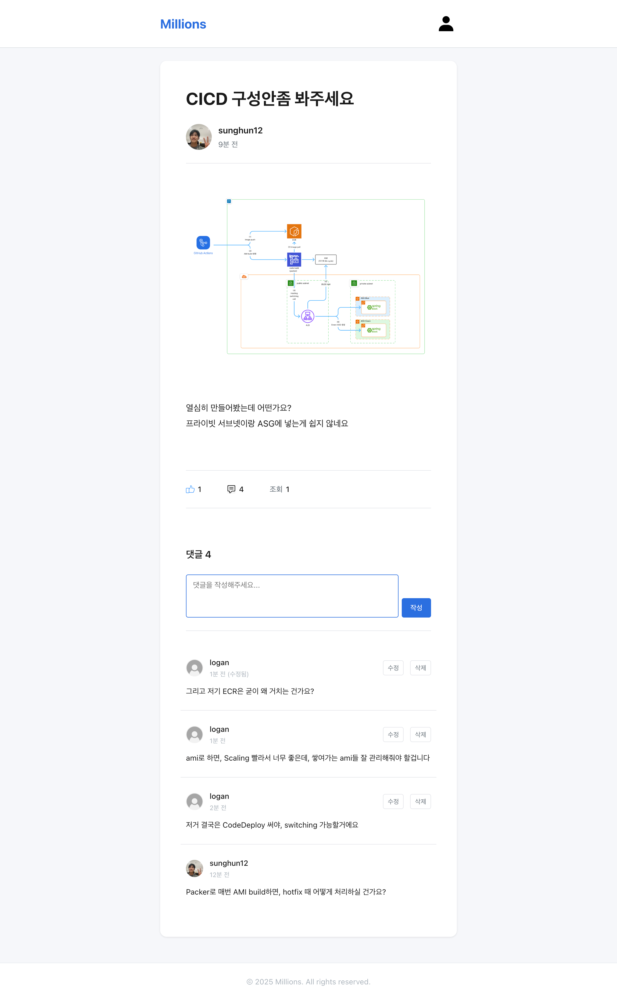

# Kaboocam 커뮤니티 프로젝트

## 프로젝트 소개
개인적인 고민과 개발을 주제로 서로 소통하는 커뮤니티 프로젝트입니다.
Vanilla JavaScript를 사용하여 구현했으며, 프론트엔드와 백엔드를 직접 개발했습니다.

## 개발 인원 및 기간
- **개발기간**: 2025-10-01 ~ 2025-12-08
- **개발 인원**: 프론트엔드/백엔드 1명 (본인)

## 사용 기술 및 도구

### Front-end
- **언어**: Vanilla JavaScript (ES6+)
- **스타일링**: CSS3, Bootstrap 5.3.8
- **서버**: Express.js 5.1.0 (정적 파일 서빙)
- **테스트**: Jest 30.2.0, Supertest 7.1.4

### Back-end
- Spring Boot, AWS (S3, CloudFront)
- [백엔드 Github 저장소](https://github.com/100-hours-a-week/3-logan-cho-community-BE)

### 인프라 & 배포
- (첨부 예정)

## 주요 기능

### 1. 인증 시스템
- JWT 기반 인증 (Access Token + HttpOnly Refresh Token)
- 자동 토큰 갱신 (Refresh Token 활용)
- 이메일 인증 코드 발송 및 검증
- 회원 탈퇴 및 복구 기능

### 2. 게시글 관리
- 게시글 작성, 조회, 수정, 삭제 (CRUD)
- 커서 기반 무한 스크롤 페이지네이션
- 최신순/인기순 정렬
- 게시글 좋아요 기능
- 조회수 카운팅

### 3. 댓글 시스템
- 댓글 작성, 수정, 삭제
- 커서 기반 페이지네이션
- 작성자 표시 및 본인 댓글 구분

### 4. 이미지 처리
- **업로드**: AWS S3 Presigned URL 활용
- **조회**: CloudFront CDN + Signed Cookie 인증
- 프로필 이미지 및 게시글 이미지 지원

### 5. 마이페이지
- 프로필 이미지 변경
- 닉네임 변경
- 비밀번호 변경
- 회원 탈퇴

<details>
<summary>폴더 구조</summary>

```
├── .dockerignore
├── .github/
├── .gitignore
├── Dockerfile
├── jest.config.js
├── jsconfig.json
├── package.json
├── server.js                    # Express 정적 파일 서버
├── tests/
│   └── server.test.js          # 서버 테스트
└── public/
    ├── index.html              # 메인 페이지
    ├── css/
    │   ├── reset.css          # CSS 리셋
    │   ├── theme.css          # 테마 변수
    │   └── layout.css         # 레이아웃 스타일
    ├── js/
    │   ├── config.js          # API 환경 설정
    │   ├── api.js             # API 요청 핸들러
    │   ├── cdn.js             # CDN 이미지 로더 (Signed Cookie)
    │   ├── dom.js             # DOM 유틸리티
    │   ├── common.js          # 공통 유틸리티
    │   └── storage.js         # 로컬 스토리지 관리
    ├── components/
    │   ├── navbar.html        # 네비게이션 바
    │   ├── navbar.css
    │   ├── post-card.css      # 게시글 카드 스타일
    │   └── mypage-dropdown.css
    └── pages/
        ├── home/              # 홈 페이지
        │   ├── index.html
        │   ├── home.html
        │   ├── home.js
        │   └── home.css
        ├── auth/              # 인증 관련 페이지
        │   ├── login/
        │   │   ├── login.html
        │   │   ├── login.js
        │   │   └── login.css
        │   ├── signup/
        │   │   ├── signup.html
        │   │   ├── signup.js
        │   │   └── signup.css
        │   └── recover/
        │       ├── recover.html
        │       └── recover.js
        ├── board/             # 게시판 관련 페이지
        │   ├── board.html     # 게시글 목록
        │   ├── board.js
        │   ├── board.css
        │   ├── postDetail.html # 게시글 상세
        │   ├── postDetail.js
        │   ├── postDetail.css
        │   └── comment.js     # 댓글 관리
        └── mypage/            # 마이페이지
            ├── mypage.html
            ├── mypage.js
            └── mypage.css
```
</details>

**구조**:
- `api.js`: 모든 API 요청 중앙 관리
- `cdn.js`: CloudFront 이미지 로딩
- `dom.js`: DOM 조작 유틸리티
- `storage.js`: 로컬 스토리지 관리
- `common.js`: 공통 함수 (날짜 포맷팅 등)

## 서비스 화면

### 홈


### 인증
| 로그인 | 회원가입 |
|--------|----------|
|  |  |

### 게시글
| 게시글 목록 | 게시글 상세 |
|------------|------------|
|  |  |

### 댓글
| 댓글 목록 | 댓글 작성 |
|----------|----------|
|  |  |

### 마이페이지
| 프로필 수정 | 비밀번호 변경 |
|-----------|--------------|
|  |  |

## 트러블 슈팅

### 1. CORS 문제 해결
**문제**: 로컬 개발 환경에서 백엔드 API 호출 시 CORS 에러 발생

**해결**:
- 백엔드에서 CORS 설정 추가
- `credentials: "include"` 옵션으로 쿠키 전송 허용
- CloudFront에서도 CORS 헤더 설정

### 2. Signed Cookie 인증 문제
**문제**: CloudFront에서 이미지 로드 시 403 에러 반복 발생

**해결**:
- `fetch` API를 사용하여 `credentials: "include"` 설정
- `` 태그의 `src`를 직접 설정하는 대신 Blob URL 사용
- 최초 요청 실패 시 자동으로 Signed Cookie 발급 및 재시도 로직 구현

```javascript
// 이미지 조회 시 Signed Cookie 자동 처리
async fetchImage(cdnBaseUrl, objectKey) {
  let res = await fetch(url, { credentials: "include" });

  // 401/403 시 쿠키 발급 후 재시도
  if ((res.status === 401 || res.status === 403) && !this._cookieReady) {
    await this._ensureCookieOnce();
    res = await fetch(url, { credentials: "include" });
  }

  return await res.blob();
}
```

### 3. 무한 스크롤 중복 로딩 방지
**문제**: 스크롤 이벤트 발생 시 중복 API 호출

**해결**:
- `isLoading` 플래그로 중복 요청 방지
- Intersection Observer API 활용 고려

```javascript
let isLoading = false;

async function loadMorePosts() {
  if (isLoading || !hasNext) return;

  isLoading = true;
  try {
    const data = await api.getPosts({ cursor: nextCursor });
    // ... 데이터 처리
  } finally {
    isLoading = false;
  }
}
```

## 프로젝트 후기

이번 프로젝트로 프론트엔드를 처음 구현하면서 블랙박스 같았던 프론트엔트 측의 작업과정을 이해하면서, 백엔드 개발자로서 프론트엔드 개발자와 협업을 할 때, 어떻게 해주는 것이 좋을지 몸소 느껴볼 수 있는 시간이었던 것 같다. 또한 보안적인 측면에서도 프론트엔드 개발자와의 소통을 통해서 한 쪽에서 구멍이 나지 않도록 더욱 많은 소통이 필요하다는 것을 다시한번 느꼈다.


### 개선 계획
- [ ] 게시물 리스트 페이지에서 게시물 요약을 보여주도록 수정

